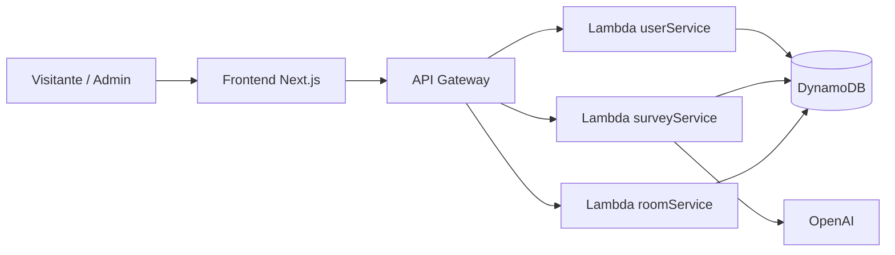
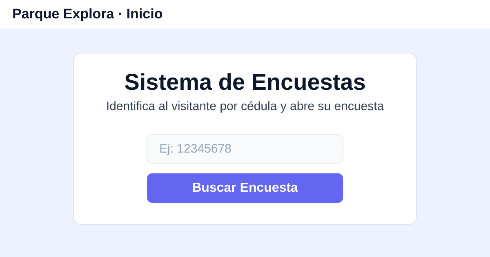
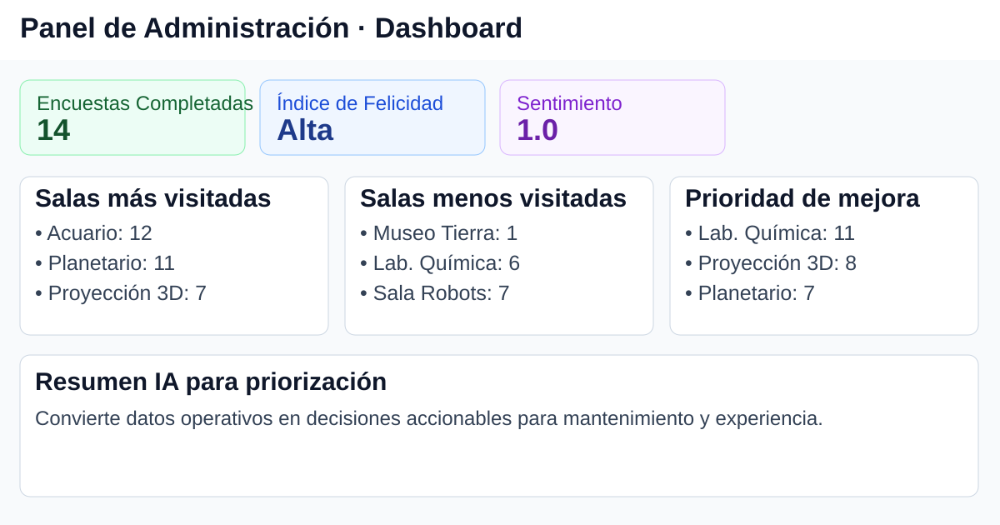
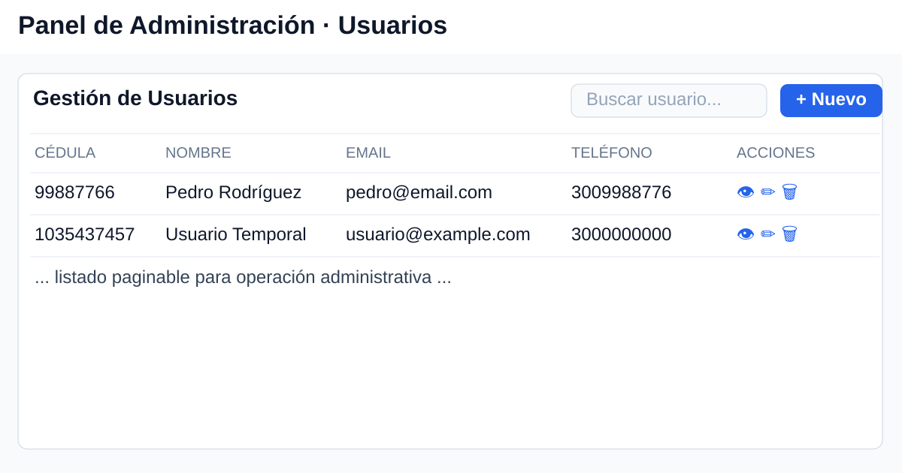
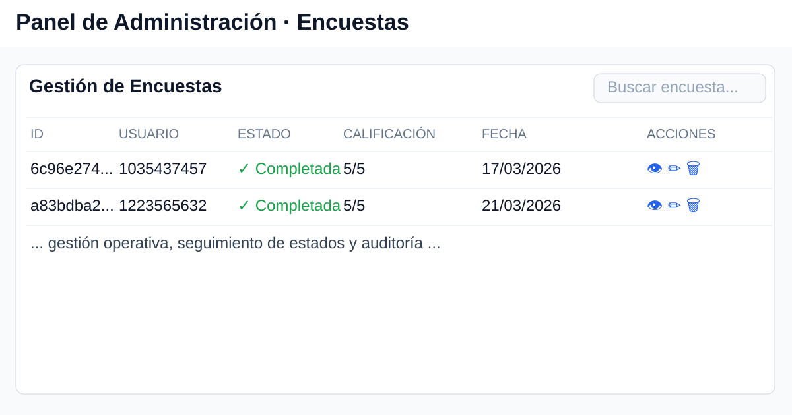

# Parque Explora Survey

Plataforma de **encuestas de satisfacción para visitantes** con panel administrativo, analítica operativa e insights automáticos.

**Stack principal:** `Next.js` + `AWS API Gateway` + `AWS Lambda` + `DynamoDB` + `OpenAI` (con fallback heurístico).

## ¿Qué resuelve este proyecto?
- Permite identificar al visitante por cédula y completar su encuesta.
- Centraliza administración de usuarios y encuestas en un panel web.
- Convierte respuestas en métricas accionables para operación del parque.
- Prioriza decisiones con un módulo de insights IA + reglas estadísticas transparentes.

## Vista general del sistema


## Galería de pantallas (qué se ve y para qué sirve)

### 1) Inicio de encuesta


**Uso:** punto de entrada para visitantes; valida cédula y dirige a la encuesta correspondiente.

### 2) Dashboard administrativo


**Uso:** monitoreo ejecutivo (encuestas completadas, felicidad, sentimiento, salas más/menos visitadas y prioridades de mejora).

### 3) Gestión de usuarios


**Uso:** consulta, búsqueda y mantenimiento de usuarios para asegurar trazabilidad de encuestas.

### 4) Gestión de encuestas


**Uso:** seguimiento del estado de encuestas, auditoría de respuestas y acciones operativas.

## Insights automatizados (IA + transparencia)
- **Proveedor principal:** `OpenAI` (`gpt-4o-mini`) para insights enriquecidos.
- **Fallback automático:** heurística local si OpenAI no está disponible.
- **Transparencia estadística:** el endpoint de insights devuelve metadatos (`meta`) con muestra, metodología, versión de fórmula y métricas de calidad.

## Inicio rápido (frontend usando API ya desplegada)
```powershell
npm --prefix "frontend" install
Copy-Item "frontend\env.example" "frontend\.env.local" -Force
npm --prefix "frontend" run dev
```

Abrir en navegador: `http://localhost:3000`

> Seguridad: las credenciales reales no se versionan. Usa placeholders en Git y configura valores reales solo en `frontend/.env.local`.

## Configuración de credenciales
Editar `frontend/.env.local` con:

```env
NEXT_PUBLIC_API_URL=<credencial-recibida>
NEXT_PUBLIC_API_KEY=<credencial-recibida>
```

Referencia de onboarding seguro: `CREDENTIAL_REQUEST.md`.

## Estructura principal
- `frontend/`: aplicación web (`Next.js`, `TypeScript`, `Tailwind`).
- `backend/functions/`: lambdas (`userService`, `surveyService`, `roomService`).
- `template.yaml`: infraestructura serverless con AWS SAM.
- `docs/`: documentación técnica y operativa del proyecto.

## Documentación recomendada
- `docs/guias-retomar-proyecto/01-inicio/00_COMIENZA_AQUI.md`
- `docs/guias-retomar-proyecto/01-inicio/RESUMEN_UNA_PAGINA.md`
- `docs/guias-retomar-proyecto/03-practica/GUIA_CONTINUAR_DESARROLLO.md`
- `docs/guias-retomar-proyecto/04-indices/INDICE_DOCUMENTACION.md`
